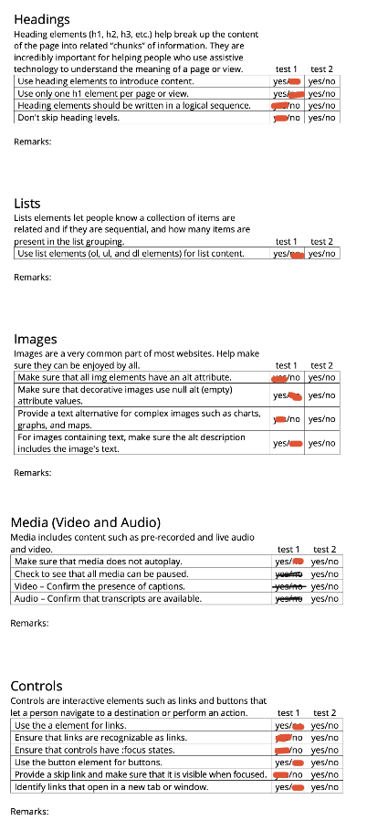

# Procesverslag
Markdown is een simpele manier om HTML te schrijven.  
Markdown cheat cheet: [Hulp bij het schrijven van Markdown](https://github.com/adam-p/markdown-here/wiki/Markdown-Cheatsheet).

Nb. De standaardstructuur en de spartaanse opmaak van de README.md zijn helemaal prima. Het gaat om de inhoud van je procesverslag. Besteedt de tijd voor pracht en praal aan je website.

Nb. Door *open* toe te voegen aan een *details* element kun je deze standaard open zetten. Fijn om dat steeds voor de relevante stuk(ken) te doen.

## Jij

  
uitwerken voor kick-off werkgroep

  ### Auteur:
  Ilham Janah 

  #### Je startniveau:
  Rood

  #### Je focus:
  Responsive
 

## Je website

  
uitwerken voor kick-off werkgroep

  ### Je opdracht:
  https://ilham-command.github.io/FED_herkansing/

  #### Screenshot(s) van de eerste pagina (small screen): 
  Mediamarkt homepage
  
  
  
  
  #### Screenshot(s) van de tweede pagina (small screen):
  Mediamarkt productpagina
  
  
  

## Toegankelijkheidstest 1/2 (week 1)

  
uitwerken na test in 2e werkgroep

  
  
  
  
  
  
  

  ### Bevindingen
  De mediamarktwebsite is een vrij gecompliceerde site waarbij de classes wel verschillend zijn, alleen hele aparte classnamen hebben. Je zou niet kunnen weten wat de definitie is van de classnamen, sinds het random letters naast elkaar zijn.

  De elementen die ik vooral wil kopiëren is onder andere de header, dat duidelijk is gebouwd met een grid, goed responsive is en de kleuren die gebruikt worden tegen hoge contrasten kan. Over het algemeen is de website van mediamarkt best accessible. Op enkele punten na, namelijk de video die daar wordt gebruikt kun je niet vertalen, heeft geen ondertiteling niks.

  Waar ik me vooral de aankomende weken op wil letten, is het semantische gedeelte van code. Je kunt het namelijk niet maken om random letters als classnaam aan te geven. 

## Breakdownschets (week 1)

  
uitwerken na afloop 3e werkgroep

  ### de hele pagina: 
  
  

## Voortgang 1 (week 2)

  
uitwerken voor 1e voortgang

  ### Stand van zaken
Na de lessen met de oefeningen van grid, ben ik begonnen met de header voor een desktop. Ik heb dus met grid een begin gemaakt met de header, door elke li een aparte frame te geven en dit naast elkaar gezet. 

</img>
</img>

  ### Agenda voor meeting
  <strong>Dit gedeelte is niet bepaald gedaan, ik denk dat we dit ook niet als opdracht kregen tijdens de les</strong>
  samen met je groepje opstellen

  | student 1      | student 2          | student 3    | student 4        |
  | ---            | ---                | ---          | ---              |
  | dit bespreken  | en dit             | en ik dit    | en dan ik dat    |
  | en dat ook nog | dit als er tijd is | nog een punt | dit wil ik zeker |
  | ...            | ...                | ...          | ...              |

  ### Verslag van meeting
  Tijdens de meeting werd de klas opgesplitst in groepen. 
  Mijn groepje kreeg feedback van de student-assistenten, ze waren over het algemeen tevreden met mijn beginnetje van de html en de css. 

  - Top: Code ziet er clean uit.
  - Top: Verstandig van je dat je grid gebruikt.
  - Tip: Begin klein, als je met een desktop versie begint,
    is het moeilijk om het responsive te maken.
  - Tip: Vergeet je H1 niet, een logo is geen h1

## Voortgang 2 (week 3)

  
uitwerken voor 2e voortgang

  ### Stand van zaken
  Vanaf week drie begon ik met mijn hamburgermenu,
  door kevin powells video(Bekijk bronnenlijst), mijn header was nu
  responsive en daar was ik heel blij mee.

  Ik begon met werken aan andere elementen van de heading, zoals de logo, zoekbalk en utility nav.

  ### Agenda voor meeting
  samen met je groepje opstellen

  | student 1      | student 2          | student 3    | student 4        |
  | ---            | ---                | ---          | ---              |
  | dit bespreken  | en dit             | en ik dit    | en dan ik dat    |
  | en dat ook nog | dit als er tijd is | nog een punt | dit wil ik zeker |
  | ...            | ...                | ...          | ...              |

  ### Verslag van meeting
  Dit was meer een meeting waarbij de docent bij iedereen langsliep. 
  Ik kreeg te horen dat ik best ver achterliep. Maar ik struggelde persoonlijk ook heel erg met mediaqueries. En besloot vanaf hier niet meer aan FED te werken en voor de herkansing te gaan.

## Toegankelijkheidstest 2/2 (week 4)

  
uitwerken na test in 9e werkgroep

  </img>
  </img>

  ### Bevindingen
  Wat ik vooral heb opgemerkt door de test, is hoe ik niet heb opgelet op 
  de chronologische volgorde van headings, maar ook hoe ik laat zien dat links klikbaar zijn. 

  Ik heb dus eigenlijk meer nagedacht over hoe ik als developer de site bouw, dan hoe de gebruiker het zou zien. 

  Mijn responsiveness van de site was wel echt top.

## Voortgang 3 (week 4)

  
uitwerken voor 3e voortgang

  ### Stand van zaken
  Ik heb dit herkanst, dus mijn proces loopt niet echt hetzelfde als dit document.

## Eindgesprek (week 5)

  
uitwerken voor eindgesprek

  ### Je uitkomst - karakteristiek screenshots:
  </img>
  </img>
  </img>
  </img>
  </img>
  </img>
  </img>
  </img>

  Wat in het algemeen goed ging, waren de hovers, responsiveness en de carousel waar ik megatrots op ben. 
    
  ### Dit ging goed/Heb ik geleerd: 
  Wat ik vooral heb geleerd, is hoe belangrijk het eigenlijk is, dat je site responsive is. Daarnaast is het helemaal niet zo moeilijk als je het eenmaal doorhebt.

  Ook heb ik verschillende gevoelens meegemaakt tijdens het bouwproces. Namelijk
  het opgeven, het niet snappen waarom het niet werkt en als ik een ding tegen mezelf kon zeggen aan het begin, is dat het belangrijk is, dat je CSS vanaf het begin goed overzicht hebt en vaker gebruik maakt van de webontwikkelaarsmiddelen van firefox browser. Zo kon ik aflezen waar de fout zat door het element te selecteren en eerst in de browser dingen uitproberen, voordat je het in VScode doet.

  

  ### Dit was lastig/Is niet gelukt:
  </img>
  </img>
  </img>
  </img>

  - De micro-interactie verschijnt wel op de detailpagina, alleen niet op de juiste plek(boven het winkelmandje)
  - Toen ik de pixels veranderde naar EM, verdween 1 streepje van mijn hamburgermenu
  - Ik wou in mijn mediaqueries zetten dat als de pagina groter wordt, de image veranderd, maar het image veranderen in mediaqueries lukte niet.
  - Ik wou voor mijn footer een arrow naast de heading zetten, die de li laat verschijnen, enkel werkte de path die MediaMarkt gebruikt, niet bij mij en heb ik het dus met een a href gedaan

## Bronnenlijst

  
continu bijhouden terwijl je werkt

  Nb. Wees specifiek ('css-tricks' als bron is bijv. niet specifiek genoeg). 
  Nb. ChatGpT en andere AI horen er ook bij.
  Nb. Vermeld de bronnen ook in je code.

  1. https://css-tricks.com/inclusively-hidden 
  2. https://www.youtube.com/watch?v=8QKOaTYvYUA*
  3. https://www.youtube.com/watch?v=qOO6lVMhmGc
  4. https://www.youtube.com/watch?v=qOO6lVMhmGc
  5. https://youtu.be/b6_u8IVVLdo?si=g4pF8SDBnJhCsx_d
  6. https://codepen.io/shooft/pen/NWePYRO Mels Bovenkamp heeft mij hiermee geholpen
  7. ChatGPT gebruikte ik voor mijn Javascript. Onder andere naast de video van de
  carousel heb ik ChatGPT gebruikt om het net wat anders te maken, sinds de video gebruikt maakt van de code van swiper en ik het gewoon wou doen met eigen html

